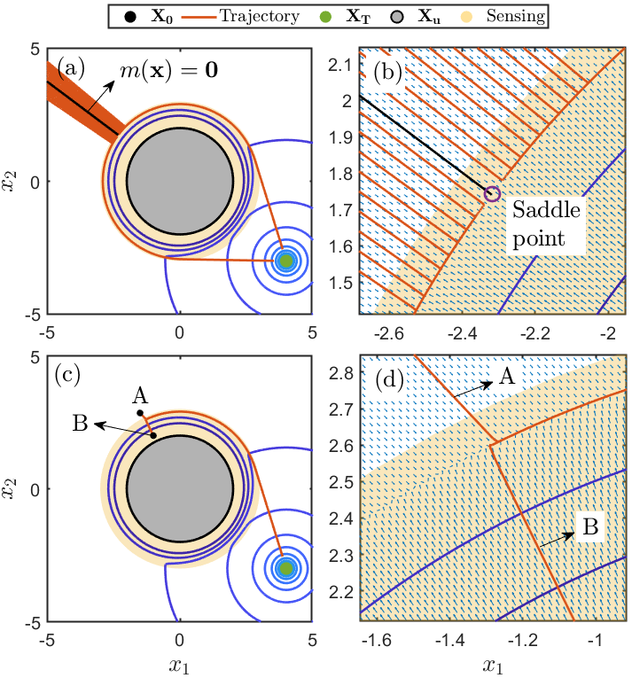

# Density Feedback Control for Obstacle Avoidance

  

This work uses an analytical construction of density function $(\rho)$ for the navigation problem. This construction relies on the inverse bump function for safety constraints. Furthermore, we show that for a system of the form:

$\dot{x} = u$

the analytical control design $u:=\frac{\partial \rho}{\partial x}$ solves a minimum distance problem.

Paper Link:
## Requirements
MATLAB 2021a and above and the MATLAB symbolic toolbox

## Run
Can run the following list of ".m" in the main directory for different setups (for the following paper: TODO link paper)
- ObstacleAvoidance.m : Generic navigation problem under spherical safety constraints
- ObstacleAvoidance_3d.m : Navigation problem into higher dimension space (3d)
- ObstacleAvoidancePaper_circ_multi_ics.m : Test a.e. stability criteria frfom a set of initial conditions

  

