# Safe Navigation using Density Functions

<div align="center">
  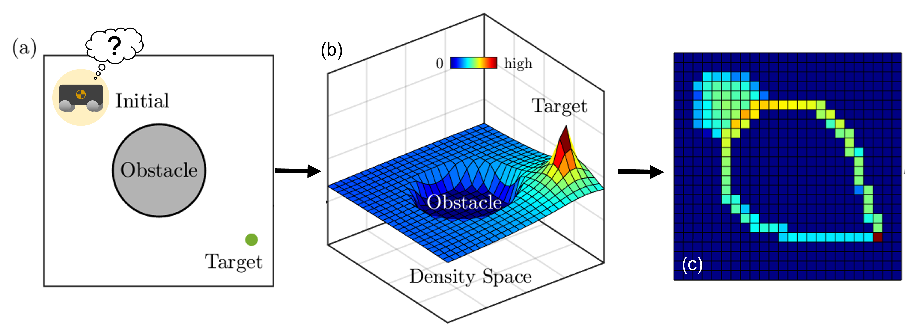
</div>

This repository implements a control-theoretic framework for **safe navigation** using **analytically constructed density functions**. The proposed approach guarantees **almost-everywhere (a.e.) convergence** to the goal while ensuring **obstacle avoidance** without requiring artificial potential fields or trajectory optimization.

This repository accompanies the publication: Safe Navigation Using Density Functions (RA-L)
```
@ARTICLE{10238751,
  author    = {Zheng, Andrew* and Narayanan, Sriram S.K.S* and Vaidya, Umesh},
  journal   = {IEEE Robotics and Automation Letters}, 
  title     = {Safe Navigation Using Density Functions}, 
  year      = {2023},
  pages     = {1-8},
  doi       = {10.1109/LRA.2023.3311334}
}
```
Extension of density functions to dynamic environments: Density Functions for Dynamic Safe Navigation of Robotic Systems (ACC)

GitHub: https://github.com/sriram-2502/time_varying_density
```
@inproceedings{sriram2025_ACC,
  title={Density Functions for Dynamic Safe Navigation of Robotic Systems},
  author={Narayanan, Sriram SKS and Moyalan, Joseph  and Zheng, Andrew and Vaidya, Umesh},
  booktitle={2025 American Control Conference (ACC)},
  pages={},
  year={2025},
  organization={IEEE}
}
```

Density functions based QP as a safety filter (similar to CBF-QP): Synthesizing Controllers for Safe Navigation Using Control Density Function

```
@inproceedings{moyalan2024synthesizing,
  title={Synthesizing controller for safe navigation using control density function},
  author={Moyalan, Joseph and Narayanan, Sriram SKS and Zheng, Andrew and Vaidya, Umesh},
  booktitle={2024 American Control Conference (ACC)},
  pages={3397--3402},
  year={2024},
  organization={IEEE}
}
```
---

## ✨ Highlights

- ✅ Analytic density function for navigation in cluttered environments
- ✅ Feedback controller directly derived as ∇ρ(x)
- ✅ Guarantees both safety and a.e. convergence
- ✅ Supports static & dynamic obstacles and moving targets
- ✅ Scales to high-dimensional systems (e.g., robotic manipulators)

---
## Construction of Density Functions
This figure shows how to construct inverse bump functions to represent arbitrarily shaped obstacles. 
<div align="center">
  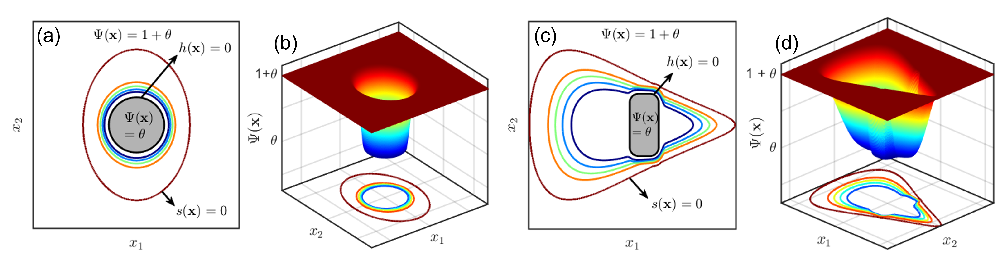
</div>

We use the inverse bump functions with a distance function to form the overall density function. The density takes zero value at obstacles, max value at the goal, and smoothly varying elsewhere, allowing its gradient to naturally guide the agent to the target while avoiding collisions.
<div align="center">
  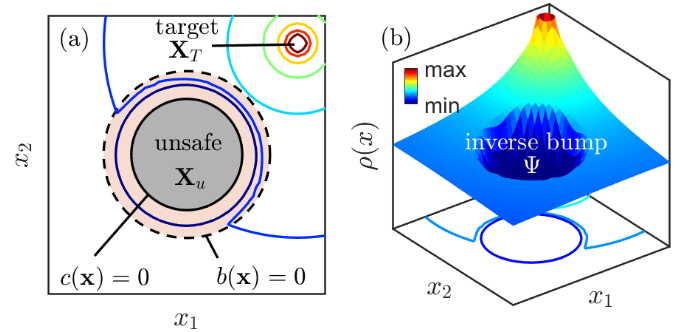
</div>

## Safety in Almost Everywhere (a.e.) sense
This figure illustrates that the controller avoids unsafe sets and converges to the target from almost all initial conditions, even in the presence of local non-convexities. The flow of the density gradient ensures that only a negligible set of initial states (defined by the zero measure set) may fail to reach the goal safely.
<div align="center">
  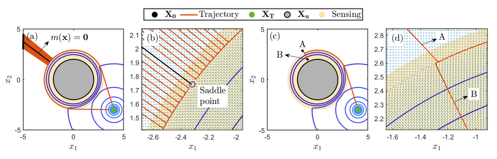
</div>

## Safe Navigation in Complex and High-Dimensional Environments
This simulation demonstrates how the density-based controller handles cluttered environments with irregular obstacle shapes, guiding the agent safely through narrow passages and around complex obstacles using only the gradient of the density.
<div align="center">
  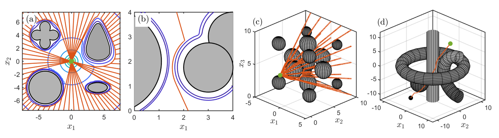
</div>

## Comparison with Navigation Functions
This comparison highlights the advantage of density-based control over traditional navigation functions. While navigation functions may get stuck near saddle points or require careful tuning, the density framework provides smoother, safer trajectories and avoids undesirable local minima.
<div align="center">
  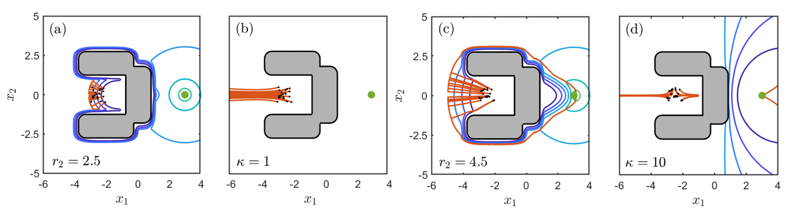
</div>

## Comparison with Control Density Functions
In this comparison, we show a comparison of control barrier functions with various tuning parameters. Note that specifying the degree of safety for the density functions through the sensing region $s$ is more intuitive and easier to tune compared to the $\gamma$ parameter in CBFs.
<div align="center">
  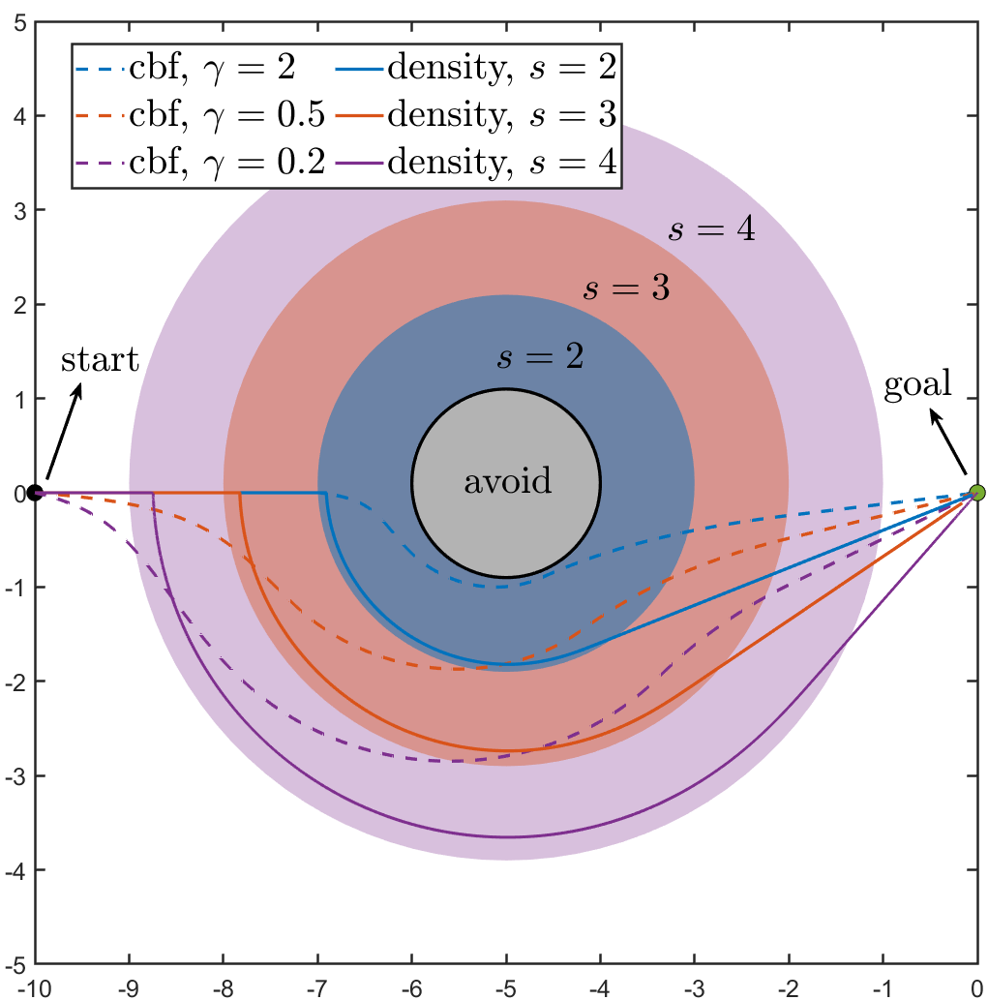
</div>

---

## Applications to Robotic Systems
**Robotic Arm**: This example shows the controller applied to a **2-link robotic arm** in its configuration space. Even with joint-level constraints and obstacle-avoidance requirements, the controller enables a smooth, collision-free trajectory with almost everywhere safety guarantees. (switch to ```robotic_arm``` branch for this simulation).
<div align="center">
  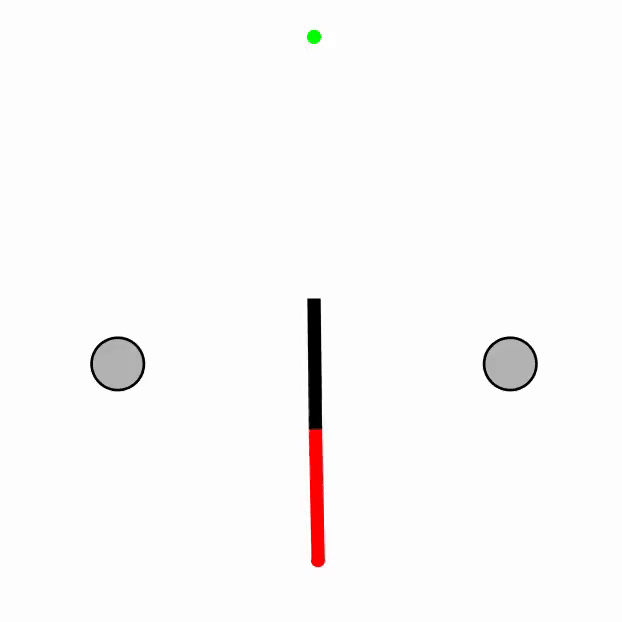
</div>

**Quadruped Robot**: In this example, we use the safe trajectory obtained from the density-based controller as a motion plan for quadruped locomotion. The robot uses a hierarchical framework (https://github.com/AndrewZheng-1011/legged_planner) to achieve safe navigation.
<div align="center">
  
</div>
---

## Extensions

**Dynamic Environments**: In this example, the density-based controller is able to account for time-varying obstacles (gray) and track a time-varying target (green). Even though the target passes through the unsafe sets, the density-based controller always finds a safe trajectory 

Scenario 1:
<div align="center">
  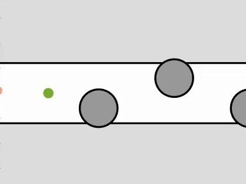
</div>
Scenario 2:
<div align="center">
  
</div>

**Control Density Functions (CDFs)**: In this extension, we use density functions to formulate a quadratic program for safe control synthesis. The following example shows safe control trajectories obtained for a double-gyre flow field. 
<div align="center">
  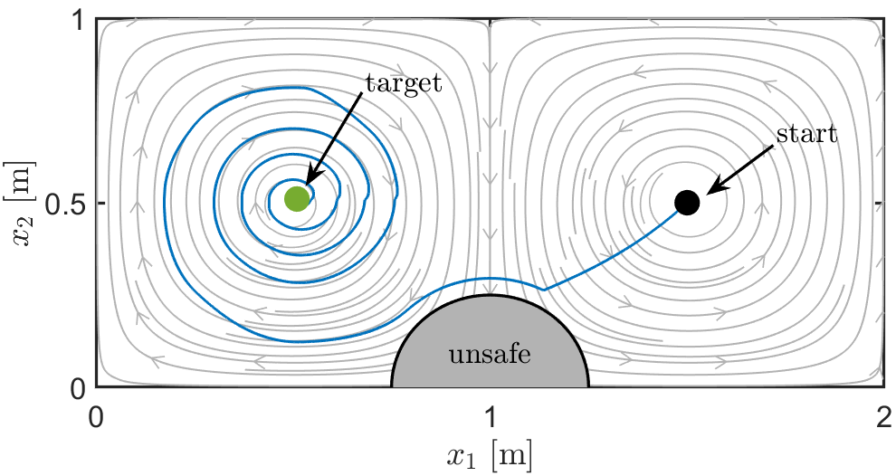
</div>

**Handling Uncertainty**: Density functions can easily account for uncertainty in the system states. The following example shows safe trajectories obtained for a dynamic bicycle model in the presence of uncertainties.
<div align="center">
  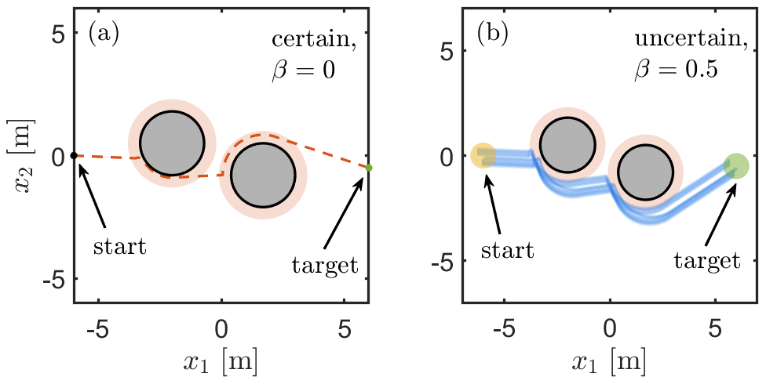
</div>

---

## 📦 Requirements

- MATLAB R2021a or later
- Symbolic Math Toolbox

---

## 🚀 Getting Started

Clone the repository and run any of the simulation scripts in MATLAB:

```bash
git clone https://github.com/DyCo-AI/density_feedback_control.git
cd density_feedback_control
```
