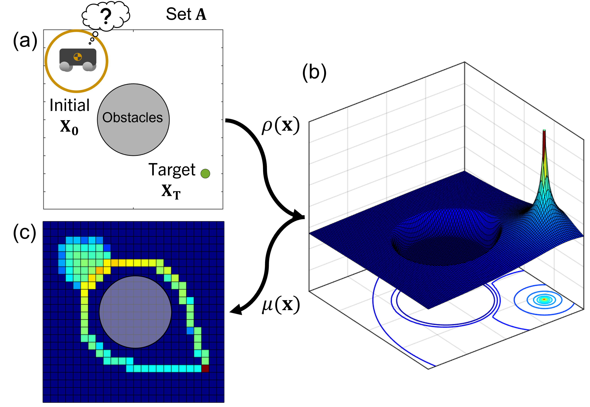
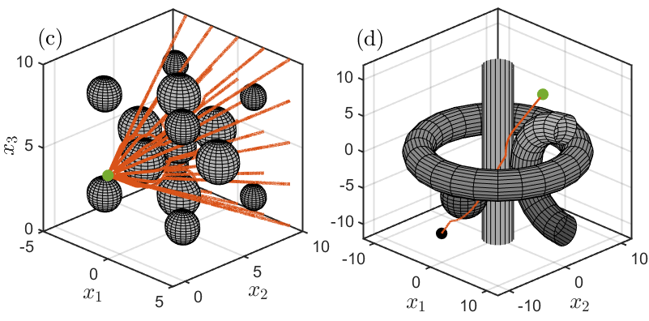
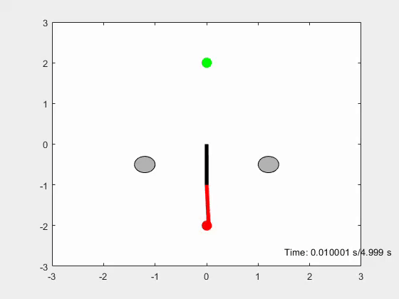

# Density Feedback Control for Obstacle Avoidance

  

This work presents a approach for safe control synthesis using dual formulation of the navigation problem using density function. The main contribution of this work is in the analytical construction of density function used for navigation of almost every initial condition with safety constraints. The analytically constructed density function provides us with a feedback controller capable of navigating in cluttered environment as well as high dimensional configuration space. Application of the developed framework is demonstrated on simple integrator dynamics and fully actuated robotic systems.

Paper Link: https://arxiv.org/abs/2306.15830
## Requirements
MATLAB 2021a and above and the MATLAB symbolic toolbox

## Run
Can run the following list of ".m" in the main directory for different setups (for the following paper: TODO link paper)
- ObstacleAvoidance.m : Generic navigation problem under spherical safety constraints
- ObstacleAvoidance_3d.m : Navigation problem into higher dimension space (3d)
- ObstacleAvoidance3D_complex.m : Navigation in higher dimension with complex obstacle shapes
- ObstacleAvoidancePaper_circ_multi_ics.m : Test a.e. stability criteria from a set of initial conditions

## Results
### Complex Environment
We showcase our results in complex 3d environment, where our algorithm is capable of navigating cluttered environments and non-trivial obstacle shapes.

  

### Robotic Arm Example
We also consider the case in which our algorithm operates in the configuration space, showcasing its capability of navigating a fully actuated 2-link robotic arm with obstacles. Implementation details of this is located in the branch `robotic_arm`.

  

Remark: 2-linked robot arm example in other branch
