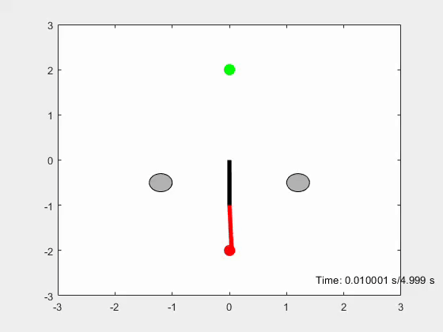

# Density based motion planner for robotic arms

This repository documents a work in progress research on developing motion planners based on density functions. The planer does not rquire any optimization and runs in real time. It can be applied to a variety of robotic systems such as ground robots, robotic arms, drones and quadrupreds. It can also be scaled to higher dimensions.

## Requirements
Basic: MATLAB

## Run
Navigate to main directory and plannarRR_joint_obs.m
